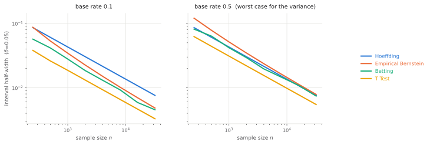

Concentration Inequalities
==========================

Every bound in the framework rests on a confidence interval for the mean of a
base variable. Which inequality builds that interval is set on the configuration
and is **orthogonal** to the ``seldonian_type`` variant:
:doc:`variants` decides *how the intervals are combined*, the inequality decides
*how wide each one is*.

.. code-block:: python

   from fair_seldonian import Inequality, SeldonianConfig

   config = SeldonianConfig(inequality=Inequality.EMPIRICAL_BERNSTEIN)

.. fs-inequality-table::

The final column is not a quoted figure: it is computed at build time by running
each implementation on one fixed Bernoulli sample, so the ordering shown is the
ordering the library actually delivers. At a base rate of 0.1 the three
distribution-free options rank betting < empirical Bernstein < Hoeffding, which
is the ranking the sections below explain. Student's t is narrower still, but see
the warning against relying on it.

The first three are distribution-free: they assume only that each contribution
lies in :math:`[0, 1]`, which the base variables satisfy by construction. Their
coverage claim holds at any sample size.

         for each of the four inequalities.

   Half-width against sample size, averaged over 15 draws. Produced by
   ``scripts/make_docs_figures.py`` calling the same implementations the library
   uses, so it cannot disagree with them.

The two panels are the whole argument for offering a choice. At a base rate of
0.1 the ordering is betting < empirical Bernstein < Hoeffding, and the gap is
large: betting is worth roughly a four-fold increase in sample size over
Hoeffding, since a half-width scales as :math:`1/\sqrt{n}`. At 0.5 empirical
Bernstein crosses *above* Hoeffding — it has paid the additive
variance-estimation term for a variance that was already the worst case — while
betting converges onto Hoeffding.

Which to use
------------

.. grid:: 1 1 3 3
   :gutter: 2

   .. grid-item-card:: Start here

      ``HOEFFDING_INEQUALITY``

      Cheap, predictable, and never worse than a constant factor off. Nothing
      about it depends on the data, so it cannot surprise you.

   .. grid-item-card:: A group's rate is small

      ``EMPIRICAL_BERNSTEIN``

      Any rate far from 1/2 — the usual case for a minority group, or for a
      constraint on a rare error. Avoid it when the rate really is near 1/2.

   .. grid-item-card:: The bound is what blocks you

      ``BETTING``

      Tightest of the three sound options at every rate. Pay for it in time:
      each endpoint takes repeated passes over the data.

.. note::

   Because these are orthogonal to :doc:`variants`, changing inequality costs one
   argument and never changes what is being certified — only how much slack the
   certificate carries. ``examples/tighter_bounds.py`` prints the full grid.

.. _inequality-hoeffding:

Hoeffding (``HOEFFDING_INEQUALITY``)
------------------------------------

The default. For a mean of :math:`n` i.i.d. terms in :math:`[0, 1]`
[Hoeffding1963]_:

.. math::

   \text{half-width} = \sqrt{\frac{\ln(c/\delta)}{2n}}

where :math:`c = 2` for a two-sided interval and :math:`c = 1` for a one-sided
one. A symmetric interval fails if *either* side is breached, so the budget must
be split between them; using :math:`\ln(1/\delta)` two-sided would deliver
coverage :math:`1 - 2\delta`, not :math:`1 - \delta`.

Hoeffding assumes the worst possible variance, :math:`1/4`. That is exactly right
for a base rate of :math:`1/2` and increasingly pessimistic away from it.

.. _inequality-empirical-bernstein:

Empirical Bernstein (``EMPIRICAL_BERNSTEIN``)
---------------------------------------------

Pays for the variance it *measures* rather than the worst case
[MaurerPontil2009]_:

.. math::

   \text{half-width}
   = \sqrt{\frac{2\hat{\sigma}^2 \ln(c/\delta)}{n}}
   + \frac{7\ln(c/\delta)}{3(n-1)}

with :math:`\hat{\sigma}^2` the unbiased sample variance. The additive second
term is the price of estimating the variance from the same sample.

**When it wins.** Tighter than Hoeffding whenever :math:`\hat{\sigma}^2 < 1/4`,
and slightly *looser* at exactly :math:`1/2`, where the additive term is paid for
nothing. Since a group's rate being small is the common case for a minority
group, this is often the better default in practice.

.. _inequality-betting:

Betting (``BETTING``)
---------------------

The Waudby-Smith and Ramdas betting interval [WaudbySmith2024]_. Two nonnegative
martingales are run against each candidate mean :math:`m` — one betting the true
mean exceeds :math:`m`, one that it falls below. Under the hypothesis each has
unit expectation, so by Ville's inequality [Ville1939]_ each exceeds
:math:`2/\delta` with probability at most :math:`\delta/2`. Rejecting when either
does gives a level-:math:`\delta` test, and inverting that test over :math:`m`
gives the interval.

The bets must be **predictable** — a function of :math:`x_1, \dots, x_{i-1}` only
— or the martingale property fails and the guarantee with it. They are therefore
computed from a running mean and variance that exclude the current observation.

**Trade-off.** It adapts to the observed variance like empirical Bernstein but
without paying the additive penalty term, so it dominates both other sound
options for bounded variables. The cost is compute: the interval is found by
anchoring at the sample mean, walking outwards until the test rejects, and
bisecting, with each step a pass over the data.

.. _inequality-t-test:

Student's t (``T_TEST``)
------------------------

.. warning::

   This is the one option that does **not** give a genuine high-confidence
   guarantee. It is what puts the *quasi* in quasi-Seldonian.

.. math::

   \text{half-width} = \frac{\hat{\sigma}}{\sqrt{n}}\, t_{1-\delta/c,\; n-1}

Student's t interval [Student1908]_ assumes the sample mean is approximately
normal. That is an appeal to the central limit theorem, not a finite-sample
bound, so the guarantee is only as good as the approximation. It is included
because [Thomas2019]_ uses it and comparisons against the published results need
it; prefer one of the three above for any claim that has to hold.

.. _inequality-clopper-pearson:

Measuring the failure rate (``clopper_pearson``)
------------------------------------------------

The four above bound a constraint *inside* the algorithm. A separate question is
whether the algorithm delivered on its promise: across repeated trials, how often
did a returned model actually violate the constraint? That rate should sit at or
below :math:`\delta`.

:func:`~fair_seldonian.experiments.results.clopper_pearson` puts an exact
binomial interval [ClopperPearson1934]_ on that count. Exactness matters here:
the interesting outcome is usually **zero** observed violations, and a normal
approximation collapses to the degenerate interval :math:`[0, 0]` — claiming
certainty from evidence that supports nothing of the kind. The exact interval
instead reports :math:`[0,\, 1 - (\delta_{\text{tail}})^{1/n}]`, which shrinks
with :math:`n` but never reaches zero.

.. code-block:: python

   from fair_seldonian import clopper_pearson

   lo, hi = clopper_pearson(successes=0, n=200, alpha=0.05)

Seeing the difference
---------------------

``examples/tighter_bounds.py`` certifies one fixed model under every combination
of ``seldonian_type`` and inequality, printing the resulting bound so the slack
attributable to each choice is visible side by side:

.. code-block:: bash

   uv run python examples/tighter_bounds.py
