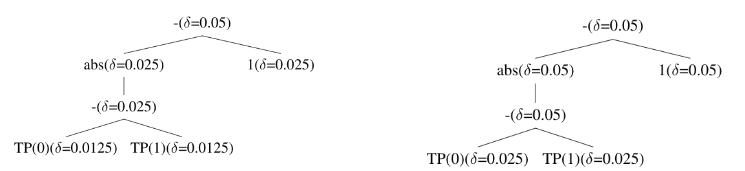
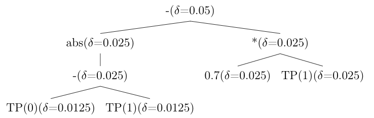
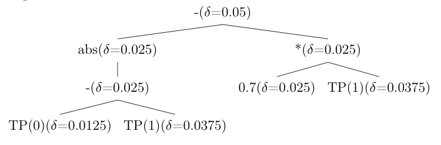

Algorithm Variants
==================

The framework implements several optimizations to the base Seldonian algorithm
[Thomas2019]_ that tighten confidence bounds, leading to improved solution rates
and objective performance. Each variant can be selected via the
``seldonian_type`` argument.

.. list-table::
   :header-rows: 1
   :widths: 12 35 53

   * - Mode
     - Name
     - Key Idea
   * - ``base``
     - Baseline QSA
     - Uniform :math:`\delta/2` splitting, standard Hoeffding bound
   * - ``mod``
     - Modified Confidence Interval
     - Decomposes candidate and safety estimation error
   * - ``const``
     - Constant-Aware Allocation
     - Skips delta splitting for constant nodes
   * - ``bound``
     - Union Bound Optimization
     - Combines delta for repeated leaf nodes
   * - ``opt``
     - All Optimizations
     - Combines ``mod``, ``const``, and ``bound``

.. _variant-base:

Baseline QSA (``base``)
-----------------------

The baseline algorithm uses uniform delta splitting and the standard Hoeffding
bound [Hoeffding1963]_ for predicting the safety test outcome during candidate
selection.

**Predicted confidence interval.** During candidate selection, the upper bound
on :math:`g(\theta)` is estimated as:

.. math::

   \hat{p} \pm 2\sqrt{\frac{\ln(1/\delta)}{2\,|\mathcal{D}_s|}}

where :math:`|\mathcal{D}_s| = (1 - r) \cdot |\mathcal{D}|` and :math:`r` is the
candidate ratio.

**Delta splitting.** At each binary operator in the constraint expression tree,
:math:`\delta` is split uniformly:

.. math::

   \delta_{\text{left}} = \delta_{\text{right}} = \frac{\delta}{2}

.. code-block:: bash

   uv run python -m fair_seldonian.experiments.runner base

.. _variant-mod:

Modified Confidence Interval (``mod``)
--------------------------------------

The baseline doubles the Hoeffding term to account for estimation error in
*both* the candidate estimate and the safety bound. This is conservative: the
two sources of error have different sample sizes.

The modified bound decomposes the interval into separate terms:

.. math::

   \hat{p} \pm \underbrace{\sqrt{\frac{\ln(1/\delta)}{2\,|\mathcal{D}_c|}}}_{\text{candidate error}}
   + \underbrace{\sqrt{\frac{\ln(1/\delta)}{2\,|\mathcal{D}_s|}}}_{\text{safety error}}

**When does this help?** When :math:`|\mathcal{D}_c| \neq |\mathcal{D}_s|`, the
decomposed form yields a tighter interval than doubling the safety-only term.
The improvement is most pronounced at extreme candidate ratios.

.. code-block:: bash

   uv run python -m fair_seldonian.experiments.runner mod

.. _variant-const:

Constant-Aware Delta Allocation (``const``)
-------------------------------------------

In the baseline, delta is split equally at every binary operator node. However,
when one child is a numeric constant (e.g., ``0.25``), its value is exact — no
confidence interval is needed. The full :math:`\delta` can therefore be allocated
to the non-constant child.

   Comparison of uniform vs. constant-aware delta allocation. When a child node
   is a constant, the full :math:`\delta` passes through to the variable subtree.

**Rule.** At a binary operator node with :math:`\delta`:

.. math::

   \delta_{\text{child}} =
   \begin{cases}
   \delta & \text{if the sibling is a constant} \\
   \delta / 2 & \text{otherwise}
   \end{cases}

.. code-block:: bash

   uv run python -m fair_seldonian.experiments.runner const

.. _variant-bound:

Union Bound Optimization (``bound``)
-------------------------------------

A fairness constraint may reference the same base variable (e.g., ``TP(1)``)
multiple times. The baseline treats each occurrence independently, assigning
each its own :math:`\delta_i`. By Boole's inequality (the union bound)
[Bonferroni1936]_, a single confidence interval with
:math:`\delta_{\text{sum}} = \sum_i \delta_i` covers *all* occurrences
simultaneously.

**Example.** Suppose ``TP(1)`` appears three times in the constraint tree with
allocated deltas :math:`\delta/2`, :math:`\delta/4`, and :math:`\delta/8`. Instead
of computing three separate intervals, a single interval is computed with:

.. math::

   \delta_{\text{sum}} = \frac{\delta}{2} + \frac{\delta}{4} + \frac{\delta}{8}
   = \frac{7\delta}{8}

This yields a wider effective :math:`\delta` and hence a *tighter* confidence
interval for each occurrence, since
:math:`\sqrt{\ln(1/\delta_{\text{sum}})} < \sqrt{\ln(1/\delta_i)}` for each :math:`\delta_i < \delta_{\text{sum}}`.

   Without union bound optimization: each occurrence of the same variable
   uses a separate, smaller :math:`\delta`.

   With union bound optimization: all occurrences share a combined
   :math:`\delta`, yielding tighter bounds.

.. code-block:: bash

   uv run python -m fair_seldonian.experiments.runner bound

.. _variant-opt:

All Optimizations (``opt``)
----------------------------

Combines the modified confidence interval (:ref:`variant-mod`), constant-aware
delta allocation (:ref:`variant-const`), and union bound optimization
(:ref:`variant-bound`) for the tightest bounds.

.. code-block:: bash

   uv run python -m fair_seldonian.experiments.runner opt

.. _variant-lagrangian:

Lagrangian/KKT Optimization
----------------------------

An alternative candidate selection strategy based on Lagrangian relaxation
[Boyd2004]_. Rather than using the barrier-style penalty in the base algorithm,
this approach formulates the constrained optimization as:

.. math::

   \mathcal{L}(\theta, \mu) = -f(\theta) + \mu \cdot \hat{g}(\theta)

where :math:`\mu \geq 0` is the Lagrange multiplier.

**Multiplier initialization.** The value of :math:`\mu` is estimated from the
gradients of the objective and constraint at the initial (unconstrained)
logistic regression solution :math:`\theta_0`:

.. math::

   \mu = \frac{-\nabla f(\theta_0)}{\nabla g(\theta_0)}

If the computed :math:`\mu` is non-positive (indicating the constraint gradient
does not oppose the objective gradient), it is set to 1.

**Implementation details:**

- The predict function returns probabilities (continuous in :math:`[0, 1]`) rather
  than discrete labels, enabling gradient computation.
- A single-pass approach is used: :math:`\mu` is computed once from the initial
  solution, then the Lagrangian is minimized over :math:`\theta` using the
  Powell optimizer. This avoids the computational cost of alternating
  optimization but may be less precise than iterative methods.

.. note::

   This variant is experimental. The functions ``_get_cand_solution2`` and
   ``_cand_obj2`` in :mod:`fair_seldonian.algorithms.qsa` implement this
   approach but are not exposed in the public API.

