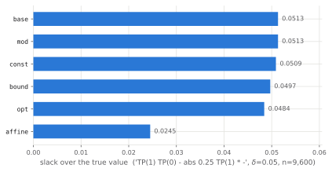
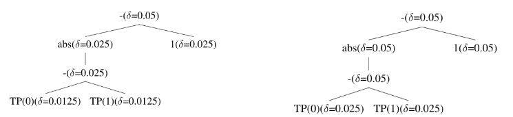
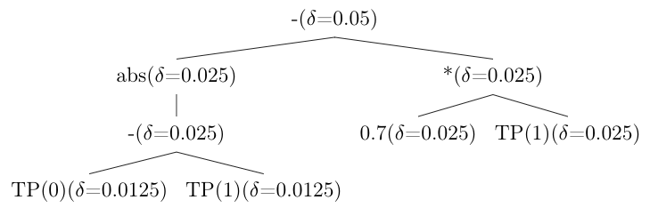
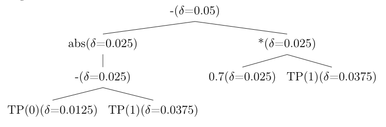

Algorithm Variants
==================

The framework implements several optimizations to the base Quasi-Seldonian
Algorithm (QSA) [Thomas2019]_ that tighten confidence bounds, leading to improved
solution rates and objective performance. Each variant can be selected via the
``seldonian_type`` argument.

This axis is independent of the :doc:`confidence inequality <inequalities>`: the
inequality sets how wide a single interval is, the variant sets how the intervals
are combined. Every pairing is accepted.

.. fs-variant-table::

         constraint value, from base at 0.0513 down to affine at 0.0245.

   Slack — how far each variant's bound sits above the true constraint value, on
   one model and one dataset. Produced by ``scripts/make_docs_figures.py``.

Read it as a ranking rather than as absolute numbers, which move with the data.
Three things it shows that the table cannot:

* **The tree optimizations are incremental.** ``const`` and ``bound`` each buy a
  little, and ``opt`` about as much as the two together — a few percent, not a
  step change.
* **Affine is the step change.** It roughly halves the slack, which at a
  :math:`1/\sqrt{n}` rate is worth about four times the data.
* **``mod`` looks identical to ``base`` here, and should.** It changes the
  *predicted* bound that steers candidate selection, not the safety bound being
  measured. Its effect shows up as a higher solution rate, not a tighter
  certificate.

The figure is drawn on the default constraint rather than demographic parity
because that one exercises every variant: it repeats ``TP(1)``, which is what
``bound`` merges, and carries a literal ``0.25``, which is what ``const``
exploits. On demographic parity both are no-ops.

.. _variant-base:

Baseline QSA (``base``)
-----------------------

The baseline algorithm uses uniform delta splitting and the standard Hoeffding
bound [Hoeffding1963]_ for predicting the safety test outcome during candidate
selection.

**Predicted confidence interval.** During candidate selection, the upper bound
on :math:`g(\theta)` is estimated as:

.. math::

   \hat{p} \pm 2\sqrt{\frac{\ln(1/\delta)}{2\,|\mathcal{D}_s|}}

where :math:`|\mathcal{D}_s| = (1 - r) \cdot |\mathcal{D}|` and :math:`r` is the
candidate ratio.

**Delta splitting.** At each binary operator in the constraint expression tree,
:math:`\delta` is split uniformly:

.. math::

   \delta_{\text{left}} = \delta_{\text{right}} = \frac{\delta}{2}

.. code-block:: bash

   uv run python scripts/run_paper_experiments.py --out exp/paper --only base

.. _variant-mod:

Modified Confidence Interval (``mod``)
--------------------------------------

The baseline doubles the Hoeffding term to account for estimation error in
*both* the candidate estimate and the safety bound. This is conservative: the
two sources of error have different sample sizes.

The modified bound decomposes the interval into separate terms:

.. math::

   \hat{p} \pm \underbrace{\sqrt{\frac{\ln(1/\delta)}{2\,|\mathcal{D}_c|}}}_{\text{candidate error}}
   + \underbrace{\sqrt{\frac{\ln(1/\delta)}{2\,|\mathcal{D}_s|}}}_{\text{safety error}}

**When does this help?** When :math:`|\mathcal{D}_c| \neq |\mathcal{D}_s|`, the
decomposed form yields a tighter interval than doubling the safety-only term.
The improvement is most pronounced at extreme candidate ratios.

.. code-block:: bash

   uv run python scripts/run_paper_experiments.py --out exp/paper --only mod

.. _variant-const:

Constant-Aware Delta Allocation (``const``)
-------------------------------------------

In the baseline, delta is split equally at every binary operator node. However,
when one child is a numeric constant (e.g., ``0.25``), its value is exact — no
confidence interval is needed. The full :math:`\delta` can therefore be allocated
to the non-constant child.

   Comparison of uniform vs. constant-aware delta allocation. When a child node
   is a constant, the full :math:`\delta` passes through to the variable subtree.

**Rule.** At a binary operator node with :math:`\delta`:

.. math::

   \delta_{\text{child}} =
   \begin{cases}
   \delta & \text{if the sibling is a constant} \\
   \delta / 2 & \text{otherwise}
   \end{cases}

.. code-block:: bash

   uv run python scripts/run_paper_experiments.py --out exp/paper --only const

.. _variant-bound:

Union Bound Optimization (``bound``)
-------------------------------------

A fairness constraint may reference the same base variable (e.g., ``TP(1)``)
multiple times. The baseline treats each occurrence independently, assigning
each its own :math:`\delta_i`. By Boole's inequality (the union bound)
[Bonferroni1936]_, a single confidence interval with
:math:`\delta_{\text{sum}} = \sum_i \delta_i` covers *all* occurrences
simultaneously.

**Example.** Suppose ``TP(1)`` appears three times in the constraint tree with
allocated deltas :math:`\delta/2`, :math:`\delta/4`, and :math:`\delta/8`. Instead
of computing three separate intervals, a single interval is computed with:

.. math::

   \delta_{\text{sum}} = \frac{\delta}{2} + \frac{\delta}{4} + \frac{\delta}{8}
   = \frac{7\delta}{8}

This yields a wider effective :math:`\delta` and hence a *tighter* confidence
interval for each occurrence, since
:math:`\sqrt{\ln(1/\delta_{\text{sum}})} < \sqrt{\ln(1/\delta_i)}` for each :math:`\delta_i < \delta_{\text{sum}}`.

   Without union bound optimization: each occurrence of the same variable
   uses a separate, smaller :math:`\delta`.

   With union bound optimization: all occurrences share a combined
   :math:`\delta`, yielding tighter bounds.

.. code-block:: bash

   uv run python scripts/run_paper_experiments.py --out exp/paper --only bound

.. _variant-opt:

All Optimizations (``opt``)
----------------------------

Combines the modified confidence interval (:ref:`variant-mod`), constant-aware
delta allocation (:ref:`variant-const`), and union bound optimization
(:ref:`variant-bound`) for the tightest bounds.

.. code-block:: bash

   uv run python scripts/run_paper_experiments.py --out exp/paper --only opt

.. _variant-affine:

Affine-Form Compilation (``affine``)
------------------------------------

The variants above all keep the same underlying strategy: wrap a confidence
interval around every node of the constraint tree and combine them with interval
arithmetic. That is sound but loose for two compounding reasons. Interval
arithmetic assumes the worst about how sub-expressions relate, even when they are
means over *disjoint* groups and therefore independent; and every leaf occurrence
spends its own slice of :math:`\delta`.

For constraints built only from ``+``, ``-``, scaling by a constant and ``abs``
— which covers the standard gap-based fairness definitions — neither cost is
necessary. Such an expression can be rewritten *exactly* as a maximum of finitely
many affine forms in the base variables:

.. math::

   g(\theta) = \max_k \left( c_k + \sum_v a_{k,v} z_v \right)

**Why one interval per form suffices.** All cells of a single group are means
over the same rows, so for group :math:`g` the partial sum
:math:`\sum_v a_v z_v` is itself the mean over that group's samples of the scalar
:math:`w_i = \sum_v a_v x_i^{(v)}`. Distinct groups are disjoint, so conditional
on the group counts their means are independent and Hoeffding applies to the
weighted sum directly:

.. math::

   \text{half-width} = \sqrt{\tfrac{1}{2}\ln(1/\delta')\sum_g r_g^2 / n_g}

with :math:`r_g` the a-priori range of :math:`w_i` within group :math:`g`. Only
:math:`K` slices of :math:`\delta` are spent — one per form — instead of one per
leaf occurrence.

**Worked example.** The constraint ``|TP(0) - TP(1)| - 0.2 TP(1) <= 0`` compiles
to ``max(TP(0) - 1.2 TP(1), -TP(0) + 0.8 TP(1))``: two forms rather than three
leaf intervals. Measured slack over the true value falls by 50.0% across sample
sizes from 10k to 160k and several parameter vectors. The ratio barely moves,
because the saving comes from the delta split and the independence of the groups
rather than from the data. Since a Hoeffding half-width scales as
:math:`1/\sqrt{n}`, halving it is worth roughly 4x the data.

**Limits.** Anything outside that fragment raises
:class:`~fair_seldonian.constraints.affine.NotAffine`. Division is the usual
cause, so the practical rule is to reach for a rate *primitive* rather than
writing the ratio out. ``TPR(1) TPR(0) - abs 0.1 -`` compiles; the equivalent
``TP(1) TP(1) FN(1) + / ...`` does not, because a quotient of two variables
cannot be rewritten as a max of affine forms.

Every builder shipped in :mod:`fair_seldonian.constraints.fairness` is written
this way and therefore compiles — see the *Affine forms* column of the generated
table in :doc:`fairness_constraints`, which is produced by running the compiler
over each one.

.. note::

   Every inequality works with ``affine``: the per-form interval is built by the
   same code as any other leaf interval, just applied to the weighted sum. Do not
   assume the per-leaf ranking carries over, though — the widths depend on the
   range of the weighted variable, not of a single cell, so the tightest
   inequality for a leaf is not always the tightest for a form.

.. code-block:: bash

   uv run python scripts/run_paper_experiments.py --out exp/paper --only affine

See :mod:`fair_seldonian.constraints.affine` for the compiler itself.

